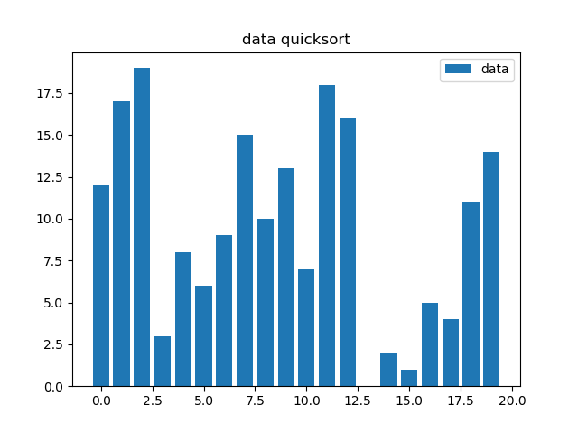

# Algorithm

## Quick Sort

If you only want to know how to implement quicksort algoritm, please read `quick.py`

If you also want to know how to plot and save pictures when sort data, please read `quick_sort.py` and `main.py`

run with command `python main.py`

